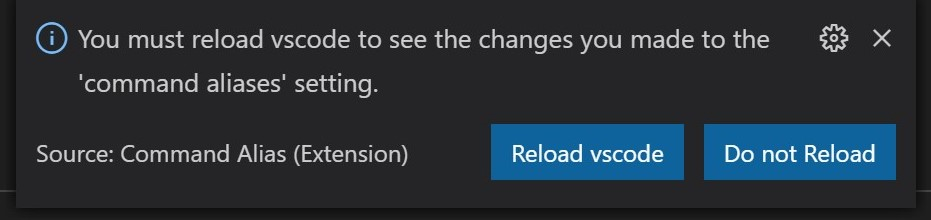

# Command Aliases  

  Create your own aliases for commands in vscode.  A command can have multiple aliases if you want.  The aliases are the command titles that show up in the Command Palette.  The built-in titles are not removed.  

  <br/>

## Requirements 

When you make a change to these settings, you will need to (and will be prompted to) reload vscode.  This is the only way to see the new aliases in the Command Palette.  Or, of course, any changes will take affect the next time vscode is started.

<br/>

<!--  -->


<br/><br/>

## Extension Settings  

This extension contributes the following settings:

* `command aliases`: a group of commands and titles/aliases.  Example in settings.json (user settings): 

```jsonc
  "command aliases": {
                                                      
    "explorer.newFile": "touch",
    "explorer.newFolder": ["mkdir", "new directory"],     // multiple aliases : use an array  

    "launches.showAllLaunchConfigs": "QP configs",        // an extension command  

    "workbench.action.reloadWindow": "restart"
  }
  ```
The commands are the same as those you could copy from `Keyboard Shortcuts`.  Use `Copy Command ID` from each command's context menu to get the actual command.

Commands are then generated from these settings either on load of the extension or when you make any change to its settings.  This extension's package.json is updated to contribute these commands and activationEvents.

-----------

You can re-use aliases for different commands - in that case vscode will show both aliases and the commands they are associated with in the Command Palette so you could pick the one you want.  I suppose you could group commands in this way.

If you had this in your settings:  

```jsonc
  "command aliases": {
    "addRootFolder": "mkdir",
    "explorer.newFolder": "mkdir"
  }
  ```

  you would see in this in your Command Palette upon typing `mkdir`:  

  <br/>

  <!--  -->


<br/><br/>

> [The gif above is slightly out-of-date.  The commands will now appear with **Alias:** preceding in the Command Palette, as in `Alias: mkdir`.  If you don't want that `Alias: ` in front, let me know in a feature request.]

<br/><br/>  

## Known Issues  

* see Requirements above re: reload on changes
* Don't use the same command in multiple places in the settings.


## Release Notes  

* 0.1.0 &emsp;  Initial release.

* 0.1.2 &emsp;  Fixed: notification only appears if change 'command-alias' setting.

### TODO

* Prevent listing the same command multiple times in the settings.
* Add a QuickPick panel of commands from which to select and add to `command aliases` settings.


-----------------------------------------------------------------------------------------------------------